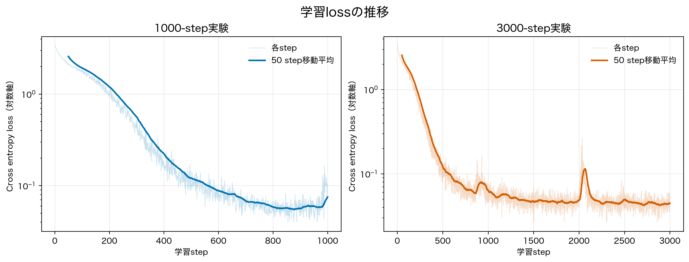
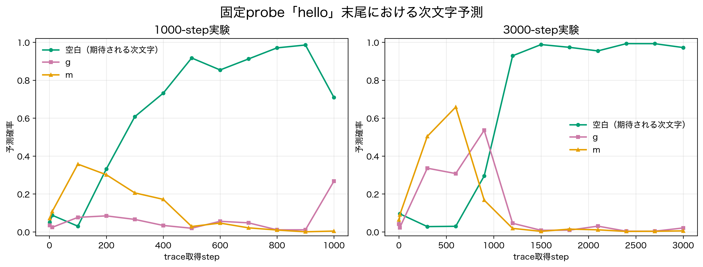
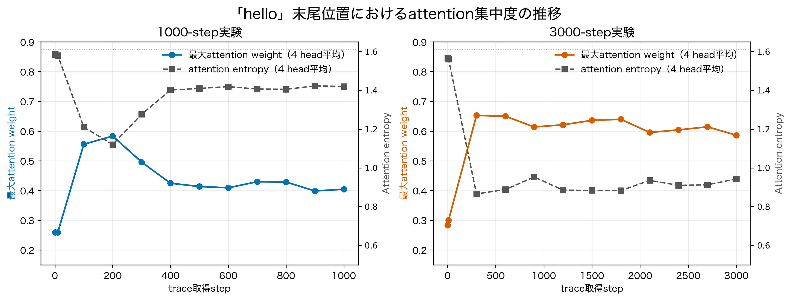
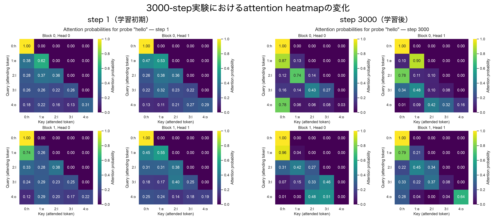

# 最小構成GPTの学習動作および内部表現取得に関する現状報告

## 1. 報告の目的

本研究では、Transformerの内部表現を解析し、将来的にはAIエージェントに対する攻撃の予兆検知へ応用することを目標としている。現段階では、その基盤となる最小構成のDecoder-only Transformer（以下、TinyGPT）を実装し、次の2点を確認した。

1. 実装したモデルが次トークン予測モデルとして学習できているか
2. 学習中のattention、各層のactivation、logits等の内部表現を取得できているか

本報告では、2026年7月18日に実施した1000 stepの学習と、2026年7月22日に実施した3000 stepの学習について、保存したtraceとその集計結果を比較する。なお、両者は同一の学習を1000 stepから3000 stepまで継続したものではなく、同じ設定で開始した別々の学習実行である。そのため、共通して現れる傾向を確認する目的で比較し、個々の数値の差をstep数だけの効果とは解釈しない。

## 2. 現在の実装

実装したモデルは、文字単位tokenizerを用いる小規模なDecoder-only Transformerである。高レベルAPIである `torch.nn.Transformer` や `torch.nn.MultiheadAttention` は使用せず、causal mask、scaled dot-product attention、multi-head attention、LayerNorm、feed-forward network、residual connectionを個別に実装している。テンソル演算およびパラメータ管理にはPyTorchを利用した。

モデルの基本構成は以下のとおりである。

| 項目 | 設定値 |
|---|---:|
| 語彙数 | 26（学習コーパスに含まれる文字） |
| 最大系列長 | 64 |
| Transformer block数 | 2 |
| attention head数 | 2 |
| 埋め込み次元 | 64 |
| dropout | 0.0 |

内部表現の取得機能では、forward処理を変えずに、次の値をCPU上の独立したsnapshotとして保存できる。

- token embedding、position embedding、および両者を加算した入力表現
- 各blockの入力、LayerNorm出力、residual connection前後の表現
- 各attention headのQ、K、V、attention score、causal mask適用後のscore、attention確率、head出力
- feed-forward networkの第1線形層、GELU、第2線形層の出力
- 最終LayerNorm出力、全語彙のlogits、および上位k件の予測確率

このtrace機能については、通常のforwardとtrace取得時のlogitsが一致すること、causal maskが未来位置を参照しないこと、attention確率が正規化されること、residual加算関係および各tensor shapeが正しいことを自動テストで確認している。

## 3. 実験条件

2回の実験に共通する条件を以下に示す。

| 項目 | 条件 |
|---|---|
| 学習データ | `data/tiny_corpus.txt` |
| tokenizer | char-level |
| optimizer | AdamW |
| learning rate | 0.001 |
| batch size | 8 |
| 実行デバイス | Apple MPS |
| PyTorch | 2.12.1 |
| 固定probe | `hello`（token ID: 10, 7, 14, 14, 17） |
| traceの予測保存数 | top 5 |
| trace取得時点 | optimizer更新後 |

学習lossは、各stepでランダムに抽出した学習batchに対するcross entropyである。一方、内部表現は学習の進行を同じ入力で比較するため、常に固定probe `hello`、batch size 1、評価モードで取得した。`hello` の末尾位置（query position 4）における次トークン予測では、学習コーパス先頭の `hello transformer.` という並びから、空白文字が期待される。

1000-step実験ではstep 1、10、および100から1000まで100 step間隔で、3000-step実験ではstep 1、10、および300から3000まで300 step間隔でtraceを保存した。

## 4. 結果

### 4.1 学習loss

| 実験 | step 1 | 最終step | 最終loss | 最後の100 stepの平均loss |
|---|---:|---:|---:|---:|
| 1000-step実験 | 3.3934 | 1000 | 0.1044 | 0.0673 |
| 3000-step実験 | 3.3382 | 3000 | 0.0565 | 0.0444 |

いずれの実験でも、初期に約3.3であったlossは学習とともに大きく低下した。1000-step実験の最後の100 stepの平均は0.0673、3000-step実験では0.0444であり、後者はより低い水準に到達した。最終step単独のlossにはランダムbatchによる変動があるため、最終値だけでなく直近100 stepの平均も併記した。

この結果から、少なくとも学習データに対する次トークン予測の最適化が正常に進み、勾配計算とパラメータ更新を含む最小学習ループが機能していることを確認できた。

**図1　学習lossの推移。** 薄線は各stepのloss、太線は50 step移動平均を示す。初期区間と収束後の変動を同時に示すため、縦軸は対数表示とした。

### 4.2 固定probeに対する次トークン予測

`hello` の直後に現れる文字について、末尾位置のtop-1予測と確率を追跡した結果を以下に示す。

| 実験 | 初期のtop-1（step 1） | 中間 | 最終stepのtop-1 |
|---|---|---|---|
| 1000-step実験 | `e`（0.0845） | step 500: 空白（0.9172） | 空白（0.7093） |
| 3000-step実験 | `b`（0.1268） | step 1200: 空白（0.9287） | 空白（0.9721） |

学習初期の予測分布は平坦で、正解である空白文字への確信は低かった。学習後半には両実験とも空白文字をtop-1として予測した。3000-step実験の最終時点では空白文字の確率が0.9721に達し、2位の `g`（0.0208）、3位の `m`（0.0054）から明確に分離した。

確率はstepごとに単調増加するわけではなく、例えば1000-step実験ではstep 900の0.9856からstep 1000の0.7093へ低下している。これは各stepの更新にランダムな学習batchを用いているためと考えられる。一方で、両実験に共通して初期の不確かな分布から、コーパス上妥当な次文字へ確率質量が集中しており、logitsおよび予測確率の学習に伴う変化をtraceで追跡できている。

**図2　固定probe `hello` の末尾位置における次文字予測確率。** 期待される空白文字と、学習途中で比較的高い確率を示した `g`、`m` を示す。左右の実験は同一学習の継続ではなく、それぞれ独立した実行である。

### 4.3 attentionの変化

固定probe `hello` の末尾文字 `o`（query position 4）が、入力中のどの位置へattentionを向けたかを調べた。系列長5に対して完全に一様なattentionであれば、各位置の重みは0.2、entropyは `ln(5) = 1.609` となる。

学習初期には、各headの最大attention weightはおおむね0.22〜0.33、entropyはおおむね1.54〜1.60であり、一様分布に近かった。学習後にはheadごとに異なる位置を参照するパターンが現れた。

3000-step実験のstep 3000では、末尾位置に対する各headの最大参照先は次のようになった。

| block | head | 最大参照位置 | 対応文字 | 最大weight | entropy |
|---:|---:|---:|---|---:|---:|
| 0 | 0 | 0 | `h` | 0.7771 | 0.8261 |
| 0 | 1 | 2 | 1つ目の `l` | 0.4185 | 1.2874 |
| 1 | 0 | 3 | 2つ目の `l` | 0.5069 | 0.7475 |
| 1 | 1 | 4 | `o`（自身） | 0.6416 | 0.9110 |

同一のqueryに対しても、4つのheadが位置0、2、3、4をそれぞれ最大参照先としており、head間の分化が観察された。また、entropyが初期値より低下していることから、attentionが特定位置へ集中するようになったことが分かる。1000-step実験でも、step 100以降に最大weightの上昇とentropyの低下が見られ、block 0の2 headが主に末尾位置と先頭位置へ注意を向ける傾向が現れた。

これらは「各headが特定の言語的機能を獲得した」ことを直ちに意味するものではないが、学習に伴いattention分布が一様状態から構造化され、その変化をhead単位・step単位で取得できていることを示す。

**図3　固定probe `hello` の末尾位置におけるattention集中度。** 最大attention weightとentropyはいずれも4 headの平均である。上部の点線は系列長5での一様分布のentropy `ln(5)` を示す。

**図4　3000-step実験におけるattention heatmapの学習前後比較。** 入力位置は `h e l l o`、行はquery、列はkeyを表す。右上の未来位置はcausal maskにより参照されない。

## 5. 現段階で確認できたこと

今回の結果から、次の点を確認した。

1. 自作した最小構成GPTは、学習コーパス上でcross entropy lossを低下させ、妥当な次文字予測を行える。
2. 同一probeに対する予測分布が、学習初期の不確かな状態から正解文字へ集中する過程を取得できる。
3. attention確率はhead別・block別に保存でき、学習に伴う参照位置の分化とentropy低下を観察できる。
4. attentionだけでなく、embedding、Q/K/V、FFN中間出力、residual前後、最終表現、logitsまで、一回のforwardに対応づけて保存できる。
5. 1000 stepと3000 stepの独立した2実験で、loss低下と内部表現の構造化という共通傾向が得られた。

したがって、現時点の実装は「小規模Transformerが学習すること」と「その内部計算を観測可能な形で記録すること」を満たしており、内部表現解析のための最小基盤として機能していると判断する。

## 6. 解釈上の制約

今回の評価は実装の動作確認を主目的としており、以下の制約がある。

- コーパスが非常に小さく、訓練データに対するlossのみを測定している。したがって、低lossは汎化性能ではなく、学習データへの適合を示す。
- 固定probeは `hello` の1種類のみであり、attention解析も主に末尾位置に限定している。
- 1000-step実験と3000-step実験は独立実行で、乱数seedもmetadataに記録されていないため、両者の差を学習step数の効果だけに帰属できない。
- attention weightは観測可能な内部量の一つだが、それ単独でモデル判断の因果的な説明になるとは限らない。
- 現時点では正常な文章のみを用いており、prompt injection等の攻撃入力と正常入力を識別できるかは未評価である。

このため、本報告の結論は「攻撃予兆を検知できた」ではなく、「将来の検知実験に必要な内部表現を取得し、学習による変化を確認できた」という段階に限定する。

## 7. AIエージェントセキュリティ研究への接続と今後の方針

攻撃予兆検知へ発展させるには、正常入力と攻撃入力をモデルへ与え、内部表現の差を定量化する必要がある。今回取得可能になったattention、各層activation、residual stream、logitsは、その比較に用いる基礎データとなる。

次の段階では、以下を進める予定である。

1. 乱数seed、学習・検証分割、複数回実行を導入し、モデル性能と内部指標の再現性を評価する。
2. probeを複数用意し、入力内容や位置が変化しても同様の傾向が得られるか確認する。
3. attention entropy、activation norm、層間変化量、logit entropy等を時系列の特徴量として自動集計する。
4. 正常promptとprompt injectionを模した入力を対にして、内部表現の分布差を測定する。
5. 攻撃成功後の判定だけでなく、生成前またはtool実行前の段階で異常傾向を検出できるか検証する。

最終的には、入力・生成stepごとの内部特徴を監視し、正常時の分布からの逸脱を検出する仕組みへ接続する。ただし、実運用規模のLLMへ一般化する前に、まず本最小モデル上で「どの内部量が攻撃入力に対して安定して変化するか」を切り分ける必要がある。

## 8. まとめ

1000 stepおよび3000 stepの学習データを解析した結果、TinyGPTの学習lossは約3.3から0.1以下へ低下し、固定probe `hello` に対してコーパス上妥当な次文字である空白を高確率で予測するようになった。また、attentionは初期の一様に近い状態から、headごとに異なる入力位置へ集中する状態へ変化した。

加えて、embeddingから各block内のattention・FFN・residual、最終logitsまでを学習stepと対応づけて保存できている。以上から、最小構成GPTの学習動作と内部表現取得機能は、今後のAIエージェントセキュリティに向けた比較実験を開始できる段階に到達したと考える。

## 付録：参照データ

- 1000-step trace: `outputs/traces/test_20260718`
- 3000-step trace: `outputs/traces/train_20260722_3000steps`
- 予測集計: `prediction_summary_1000steps.csv`, `prediction_summary_3000steps.csv`
- attention集計: `attention_summary_1000steps.csv`, `attention_summary_3000steps.csv`
- attention heatmap: `attention_heatmaps_1000steps/`, `attention_heatmaps_3000steps/`
